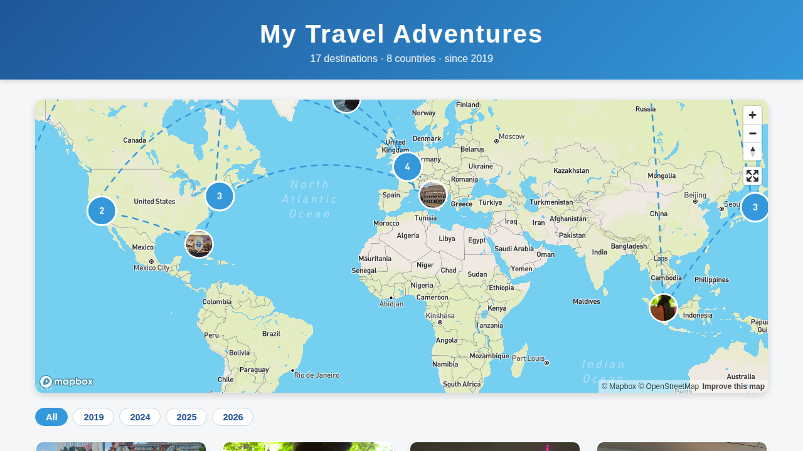

# My Travel Adventures

An interactive map of the places I've been — photo markers, a dashed great-circle route through every stop, and a card grid of memories.

**Live site:** https://fanyiyang.github.io/travel-map/



## Features

- **Interactive Map:** Displays travel destinations as photo markers on a Mapbox-powered map, with zoom and fullscreen controls.
- **Photo Markers & Popups:** Each stop is marked with its own photo; clicking a marker opens a popup with the pictures and a short note — multiple photos per place are shown as a small carousel.
- **Timeline & Year Filter:** Destinations carry an optional trip date (auto-read from the photo's EXIF), order themselves chronologically, show a year badge, and can be filtered by year.
- **Smooth Map Navigation:** Fly-to functionality zooms in on a location (and opens its popup) when a place card is clicked.
- **Place Cards:** Displays images and descriptions for each destination in a responsive grid, with lazy-loaded images.
- **Visualized Route:** Connects all destinations in trip order with dashed great-circle arcs (computed with Turf.js), including segments that cross the antimeridian.
- **Easy Updates:** A built-in [add.html](add.html) helper page adds new destinations — no manual code editing required. Photos are compressed in the browser before upload so the site stays fast.
- **No runtime geocoding:** Coordinates are stored with each destination in `places.js`, so the page loads instantly with no geocoding API calls.

## Adding a Destination

Open **[add.html](https://fanyiyang.github.io/travel-map/add.html)** and follow the four steps:

1. **Photos** — choose one or more pictures from your computer (the first is the cover; filenames are suggested automatically, and large photos are compressed in the browser before upload).
2. **Details** — enter the place name, a short note, and the trip date (auto-filled from the photo's capture date when available).
3. **Location** — usually filled in automatically from the photo's GPS data, or from the place name; you can also search, click the map, or drag the pin to fine-tune.
4. **Publish** — paste a GitHub token and click *Publish to GitHub*. The page uploads the photos and appends the entry to `places.js` for you; the live site updates once GitHub Pages rebuilds (a minute or two).

The token needs to be a [fine-grained personal access token](https://github.com/settings/personal-access-tokens/new) scoped to this repository with **Contents: Read and write** permission. Create it once and tick *Remember token in this browser*.

Prefer to do it by hand? The same page generates a ready-made snippet — upload your photo to the repo, then paste the snippet into the array in `places.js`:

```javascript
{ "name": "Kyoto, Japan", "description": "Temples and tea", "images": ["kyoto.jpg", "kyoto2.jpg"], "coordinates": [135.7681, 35.0116], "date": "2026-04-05" },
```

## Technologies Used

- **HTML/CSS:** Structure and styling, including a responsive design and grid layout for place cards.
- **JavaScript (ES6):** Map interactivity and dynamic DOM updates — no build step, no framework.
- **Mapbox GL JS:** Map rendering, markers, popups, and drawing the route.
- **Mapbox GL Geocoder:** Place search on the add-destination page.
- **Turf.js:** Great-circle arcs between destinations.
- **GitHub API:** One-click publishing of new destinations from `add.html`.

## Running Locally

```bash
git clone https://github.com/fanyiyang/travel-map.git
cd travel-map
```

Open `index.html` in your browser, or serve the folder (`python3 -m http.server`) and visit http://localhost:8000.

## Project Structure

| File | Purpose |
| --- | --- |
| `index.html` | The travel map page |
| `places.js` | Destination data (name, note, photo, coordinates) |
| `add.html` | Helper page for adding new destinations |
| `*.jpg / *.jpeg` | Destination photos |

## Destinations So Far

Hokkaido · Singapore · New York City · Boston · Miami · Las Vegas · San Francisco · London · Edinburgh · Switzerland · Reykjavik · Tokyo · Kamakura · Hawaii · Marseille · Rome

## Mapbox Token

To use this project with your own Mapbox account, replace the access token near the top of the `<script>` in `index.html` and `add.html` with your own [public token](https://docs.mapbox.com/help/getting-started/access-tokens/) (and consider restricting it to your site's URL in the Mapbox dashboard).

## Future Enhancements

- Add more travel destinations with custom categories and filters.
- Implement user-generated travel recommendations and reviews.
- Provide weather and local tips for each destination.

## License

This project is licensed under the MIT License.

---

Enjoy exploring the world through **My Travel Adventures**!
